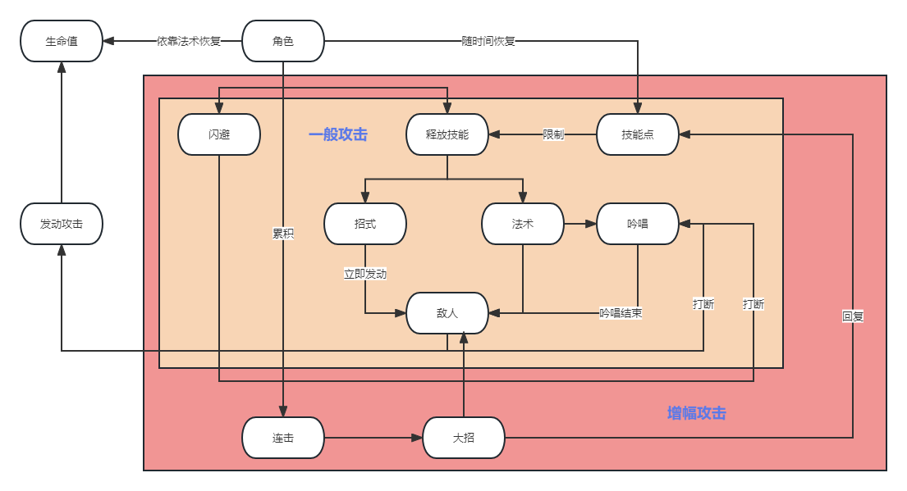

# 战斗设计文档

## 原型阶段

### 战斗机制

描述角色如何进行战斗，战斗的核心机制是什么，例如只狼的架势，原神的元素反应，破晓传说的技能点，永劫无间的僵直连招。精准到动作和参数。

### 概述

战斗中玩家的行为可以用下图概括：



#### 攻击方式

攻击分为增幅攻击和一般攻击。

一般攻击根据场上角色有不同的攻击方式，目前指定战士和法师两种，攻击方式也分为两种，招式和法术，这两种攻击方式战士和法师都可以使用，但是战士的招式攻击占比大，法师的法术攻击占比大。角色使用这两种攻击时需要消耗技能点，根据技能点花费的多少，技能具有不同的伤害幅度，而且招式可以立即发动，而多数法术则需要吟唱，被打断则法术释放失败。敌人的攻击和角色主动闪避都会打断法术的吟唱。

增幅攻击是当角色的连击数累计到一定数值以后，角色此时可以释放特殊的攻击。

##### 一般攻击状态机

* 如果1s内没有再次输入attack，且Attack播放完成，转到默认状态；

* 如果处于默认状态，按下攻击，转到Attack1；

* 如果1s内按下攻击且当前状态为Attack1，且播放大于0.8，转到Attack2；

* 如果1s内按下攻击且当前状态为Attack2，且播放大于0.8，转到Attack3；

#### 数值系统

游戏中战斗的数值方面分为生命值，攻击力，防御力，还有技能点，连击数5种数值，其中除技能点和连击数是角色特有外，前四种属性敌人和角色是共有的。

* 生命值是一个单位在战斗中存活的依据，减小到0后单位死亡；
* 攻击力是单位攻击后造成伤害的依据；
* 防御力能使单位对受到的伤害进行衰减；
* 技能点限制技能释放；
* 连击数随攻击命中累计；

实际伤害=max(0,攻击力*技能倍率/(防御力/攻击力))


参考：

```
### 生命值系统

描述HUD中如何显示出最新的生命值；什么情况下玩家掉血和补血；玩家如何得知生命偏低的情况。精确到参数。

-  非常状态 —— 描述全部的玩家可能会进入的非常状态（眩晕、中毒、变成婴儿等），以及这些状态对操作的影响。
-  命数（如果有的话） —— 说明怎么获得或失去命数，以及命数用完的结果。
-  死亡（如果有的话） —— 描述死亡时会发生什么情况。列举出需要特殊动画的情况（开火、溺水等）。游戏结束时会怎样？游戏结束的画面是怎么样？死亡会有惩罚吗？
-  检查点系统 —— 描述游戏里的检查点系统。自动保存系统是如何工作的。

### 战斗得分

给各种动作赋予分数值，然后解释一下当玩家达到了要求会发生什么，在游戏里玩家如何获取额外奖励（比如连招或者连击），例如破晓传说中玩家连击达到一定条件进入狂热，或者能配合队友进行特殊攻击。要描述达成机制以后会有什么表现，不论是音效还是视觉上。精准到动作和参数。

### 战斗机制

描述角色如何进行战斗，战斗的核心机制是什么，例如只狼的架势，原神的元素反应，破晓传说的技能点，永劫无间的僵直连招。精准到动作和参数。

### 敌人和弱点

设计不同敌人，围绕战斗机制设计它们的特性，体现游戏的策略性，例如如何应对快速移动的敌人和难以破防的敌人。要描述达成机制以后会有什么表现，不论是音效还是视觉上。同样精准到参数，例如敌人的韧性之类的。

### 可使用的道具

添加到道具设计的清单中，说明道具用途和获得方式。精准到参数和动作。

### 资源管理

达成上述条件之后，注重打击感和画面，在上面设计同时最好用表格管理镜头，音效，画面的处理，精准到用什么参数什么设置。
```

