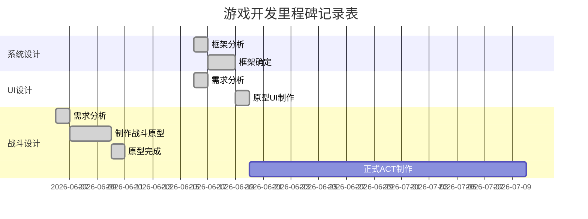

# 游戏设计文档

## 基本信息

- 项目名称：Blue Protocol
- 项目开始日期：6.3
- 项目结束日期：6.12
- 团队组长：李晓阳
- 团队成员：高梓钦 王温徽 董睿 田鑫

## 项目目标

- 总体目标：课程游戏设计，这是一个3D即时战斗的RPG游戏。

## 项目里程碑


## 内容和工作分配

### 具体分工

|  成员  |   分工    | 描述                       | 百分比 |
| :----: | :-------: | :------------------------- | :----: |
| 李晓阳 | 策划/文档 | 策划意见，汇报PPT制作      |   10   |
| 高梓钦 | 策划/程序 | 所有策划，以及游戏Demo实现 |   80   |
| 王温徽 |   策划    | 策划意见                   |   4    |
|  董睿  |   策划    | 策划意见                   |   3    |
|  田鑫  |   策划    | 策划意见                   |   3    |

## 开发环境

* Unity 2020.3.45(及以前版本，后面的版本可能有问题) 3D URP

* 版本控制Git，[仓库地址](https://github.com/ANKIIMA/GameDesign-ARPG)。

## 其它说明

### 素材网站

#### 动画

* https://www.mixamo.com/#/ 单纯的动画网站Mixamo，能找到多数的一般动作；
* https://assetstore.unity.com/ 资产商店，每周开发者能嫖一个付费资产；

#### 音效/配乐

* https://www.aigei.com/ 上面音效配乐为主，也有一些特效UI等素材；

#### 模型

* https://www.aplaybox.com/ 模之屋的模型以二次元为主，但是使用需要用Blender的cats插件将pmx转成fbx，具体看这篇[博客](https://ankiima.github.io/2023/04/20/unity8/#more)；
* https://gamedev3d.com/forum-92-1.html 游研堂除了模型还有动作，不过感觉比较少，而且好像多数要付费；
* https://texture.ninja/ 一个纹理网站。

# 设计文档

## 游戏基本信息

- 游戏类型：ARPG/JRPG
- 游戏世界观/剧情：
- 虚构的幻想历史背景。海拉鲁是一片远离其它区域的海岛海拉鲁上存在一种叫做拉鲁的蓝色粒子物质，所有海拉鲁生物都拥有这种拉鲁，并且能释放这种能影响精神的物质。生物死后将释放全部的拉鲁；拉鲁中存储着生物生前最擅长的能力。猎人的拉鲁是捕猎技巧，麻雀的拉鲁是飞行技巧，战士的拉鲁是战斗技巧。通过打败敌人或者完成任务获得拉鲁，主角不断成长。拉鲁给予主角的可能是属性值，也可能是特殊的技能，或者其它武器的使用方式。

## UI设计

### 开始画面


点击Start开始游戏，Exit退出游戏。

### HUD


### 背包


按B打开背包，再次按B关闭背包，点击图标使用物品，图标左上角显示物品数量，点击右下角显示详细描述；点击下方Delete items删除物品，点击Sort inventory进行排序，Space表示当前空间。

### 对话


靠近NPC显示对话按键提示，按键触发后显示对话框，继续按键显示下一条对话。

## 战斗设计

### 战斗机制

### 概述

战斗中玩家的行为可以用下图概括：


#### 攻击方式

攻击分为增幅攻击和一般攻击。

一般攻击根据场上角色有不同的攻击方式，目前指定战士和法师两种，攻击方式也分为两种，招式和法术，这两种攻击方式战士和法师都可以使用，但是战士的招式攻击占比大，法师的法术攻击占比大。角色使用这两种攻击时需要消耗技能点，根据技能点花费的多少，技能具有不同的伤害幅度，而且招式可以立即发动，而多数法术则需要吟唱，被打断则法术释放失败。敌人的攻击和角色主动闪避都会打断法术的吟唱。

增幅攻击是当角色的连击数累计到一定数值以后，角色此时可以释放特殊的攻击。

目前角色具备剑、大剑两种攻击方式，各有四种攻击招式。

##### 一般攻击状态机

* 如果1s内没有再次输入attack，且Attack播放完成，转到默认状态；

* 如果处于默认状态，按下攻击，转到Attack1；

* 如果1s内按下攻击且当前状态为Attack1，且播放大于0.3，转到Attack2；

* 如果1s内按下攻击且当前状态为Attack2，且播放大于0.3，转到Attack3；

#### 数值设计

游戏中战斗的数值方面分为生命值，攻击力，防御力，还有技能点，连击数5种数值，其中除技能点和连击数是角色特有外，前四种属性敌人和角色是共有的。

* 生命值是一个单位在战斗中存活的依据，减小到0后单位死亡；
* 攻击力是单位攻击后造成伤害的依据；
* 防御力能使单位对受到的伤害进行衰减；
* 技能点限制技能释放；
* 连击数随攻击命中累计；

实际伤害=max(0,攻击力*技能倍率/(防御力/攻击力))

## 系统设计

游戏系统主要有移动系统，战斗系统，连招系统，属性系统，对话系统，背包系统。


## 美术风格

使用卡通渲染风格，其中场景使用资产自带的Shader，人物使用UnityURPToonLitShaderExample的开源Shader。

## 音效设计

包括背景音乐，武器挥动音效，受击音效。使用Scripts Objects创建音效分类清单管理音效Clip，背景音乐默认播放不做管理，音效清单有Sword，Great Sword，Hit三种类型的音效。


音效清单获取音效后，初始化方法中用字典存储文件和对应音效名方便查找，给出GetClip方法根据类型随机返回该类别中的某个音效。


使用GameAssets类继承实现单例，Awake调用初始化处理文件字典索引，并给出PlaySoundEffect方法设置AudioSource的Clip并播放该Clip。

# 资源清单和目录

```
├─Animations		存放动画资源
├─Audios			存放音频资源
├─Models		   	存放模型的FBX和材质，配套纹理，材质和纹理分别使用一个和FBX同级的文件夹。
├─Others			存放Input System的配置文件，对话文本等内容。
├─Prefabs			存放预制件
├─Shaders			存放着色器
├─Scenes			存放场景
├─Scripts			存放脚本文件
└─Sprites			存放图片资源，注意这里不存放模型的纹理，模型配套的纹理和模型放在一起。这里主要是UI和地编使用。
```

