# 游戏设计文档

## 基本信息

- 项目名称：Blue Protocol
- 项目开始日期：6.3
- 项目结束日期：6.12
- 团队组长：李晓阳
- 团队成员：高梓钦 王温徽 董睿 田鑫

## 项目目标

- 总体目标：课程游戏设计，这是一个3D即时战斗的RPG游戏。

## 项目里程碑

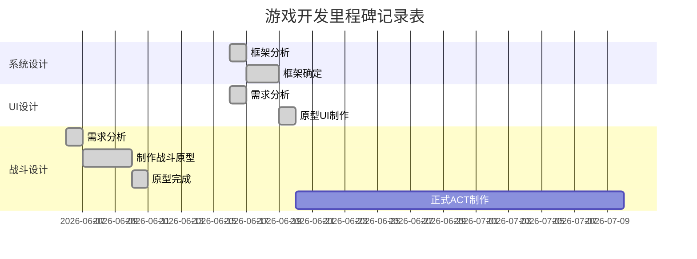
## 内容和工作分配

### 具体分工

|  成员  |   分工    | 描述                                     | 百分比 |
| :----: | :-------: | :--------------------------------------- | :----: |
| 李晓阳 | 策划/文档 | 策划意见，汇报PPT制作，场景/UI素材，文档 |   20   |
| 高梓钦 | 策划/程序 | 战斗，文案策划，以及游戏Demo实现，文档   |   70   |
| 王温徽 |   策划    | 策划意见                                 |   6    |
|  董睿  |   策划    | 策划意见                                 |   2    |
|  田鑫  |   策划    | 策划意见                                 |   2    |

## 开发环境

* Unity 2020.3.45(及以前版本，后面的版本可能有问题) 3D URP

* 版本控制Git，[仓库地址](https://github.com/ANKIIMA/GameDesign-ARPG)。

## 其它说明

### 素材网站

#### 动画

* https://www.mixamo.com/#/ 单纯的动画网站Mixamo，能找到多数的一般动作；
* https://assetstore.unity.com/ 资产商店，每周开发者能嫖一个付费资产；

#### 音效/配乐

* https://www.aigei.com/ 上面音效配乐为主，也有一些特效UI等素材；

#### 模型

* https://www.aplaybox.com/ 模之屋的模型以二次元为主，但是使用需要用Blender的cats插件将pmx转成fbx，具体看这篇[博客](https://ankiima.github.io/2023/04/20/unity8/#more)；
* https://gamedev3d.com/forum-92-1.html 游研堂除了模型还有动作，不过感觉比较少，而且好像多数要付费；
* https://texture.ninja/ 一个纹理网站。

# 设计文档

## 游戏基本信息

- 游戏类型：ARPG/JRPG
- 游戏世界观/剧情：
- 虚构的幻想历史背景。海拉鲁是一片远离其它区域的海岛海拉鲁上存在一种叫做拉鲁的蓝色粒子物质，所有海拉鲁生物都拥有这种拉鲁，并且能释放这种能影响精神的物质。生物死后将释放全部的拉鲁；拉鲁中存储着生物生前最擅长的能力。猎人的拉鲁是捕猎技巧，麻雀的拉鲁是飞行技巧，战士的拉鲁是战斗技巧。通过打败敌人或者完成任务获得拉鲁，主角不断成长。拉鲁给予主角的可能是属性值，也可能是特殊的技能，或者其它武器的使用方式。

## UI设计

### 开始画面

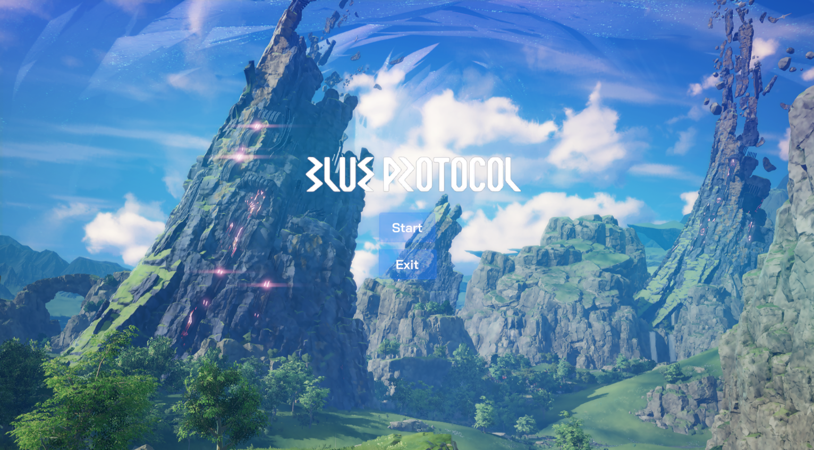

点击Start开始游戏，Exit退出游戏。

### HUD

### 背包

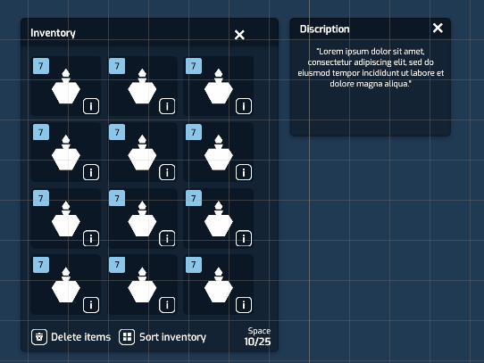

按B打开背包，再次按B关闭背包，点击图标使用物品，图标左上角显示物品数量，点击右下角显示详细描述；点击下方Delete items删除物品，点击Sort inventory进行排序，Space表示当前空间。

### 对话

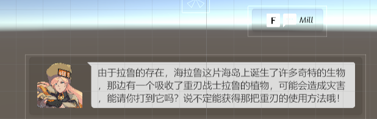

靠近NPC显示对话按键提示，按键触发后显示对话框，继续按键显示下一条对话。

## 战斗设计

### 战斗机制

### 概述

战斗中玩家的行为可以用下图概括：

#### 攻击方式

攻击分为增幅攻击和一般攻击。

一般攻击根据场上角色有不同的攻击方式，目前指定战士和法师两种，攻击方式也分为两种，招式和法术，这两种攻击方式战士和法师都可以使用，但是战士的招式攻击占比大，法师的法术攻击占比大。角色使用这两种攻击时需要消耗技能点，根据技能点花费的多少，技能具有不同的伤害幅度，而且招式可以立即发动，而多数法术则需要吟唱，被打断则法术释放失败。敌人的攻击和角色主动闪避都会打断法术的吟唱。

增幅攻击是当角色的连击数累计到一定数值以后，角色此时可以释放特殊的攻击。

目前角色具备剑、大剑两种攻击方式，各有几种攻击招式，攻击招式可以任意衔接。

##### 一般攻击状态机

* 如果1s内没有再次输入attack，且Attack播放完成，转到默认状态；

* 如果处于默认状态，按下攻击，转到Attack1；

* 如果1s内按下攻击且当前状态为Attack1，且播放大于0.3，转到Attack2；

* 如果1s内按下攻击且当前状态为Attack2，且播放大于0.3，转到Attack3；

#### 数值设计

游戏中战斗的数值方面分为生命值，攻击力，防御力，还有技能点，连击数5种数值，其中除技能点和连击数是角色特有外，前四种属性敌人和角色是共有的。

* 生命值是一个单位在战斗中存活的依据，减小到0后单位死亡；
* 攻击力是单位攻击后造成伤害的依据；
* 防御力能使单位对受到的伤害进行衰减；
* 技能点限制技能释放；
* 连击数随攻击命中累计；

实际伤害=max(0,攻击力*技能倍率/(防御力/攻击力))

## 关卡设计

游戏中包含一个原型关卡，主角从NPC处接取任务后，执行任务内容，也就是打败敌人，之后获得敌人掉落的拉鲁，然后角色与拉鲁互动获得新的武器，并回到NPC处提交任务，获得奖励。之后能选择利用获得的道具继续和敌人进行战斗。

## 系统框架设计（Gameplay）

游戏系统主要有移动系统，战斗系统，AI系统，属性系统，UI系统。

### 移动系统框架

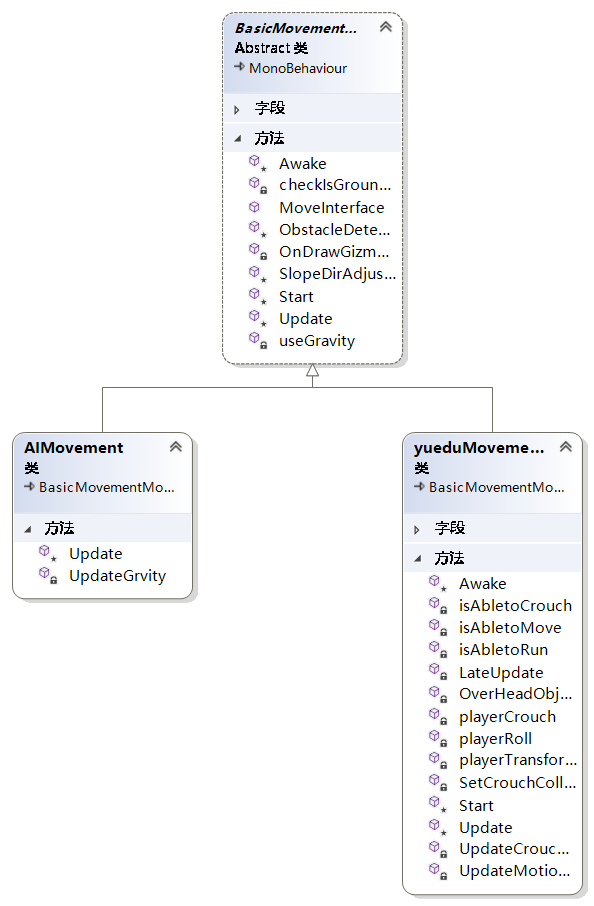

游戏中几乎所有角色都需要移动，因此有必要抽取基类作为抽象类实现共有的功能。角色均使用character controller组件实现移动，character controller的Move方法不提供重力模拟，所以基类要提供的功能是：地面检测，障碍物检测，斜面方向调整，重力模拟，以及必要组件的引用。注意我们不在基类中计算移动方向，因为玩家和其它角色的移动方向不同，玩家需要根据摄像机来更正方向，而其它角色则由AI控制，因此我们这里仅给出一个公开的移动方法，该方法接受移动方向、移动速度、是否启用重力为参数，根据这些值调用character controller的Move实现移动。

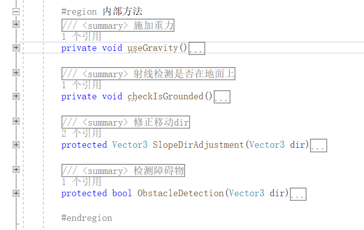

其中地面检测使用CheckSphere方法配合LayerMask完成；障碍物检测根据移动方向进行Raycast检测是否前方存在障碍物；重力模拟首先检测是否在地面上，不在地面上则添加Y方向上的速度完成重力模拟。而由于Move方法不能模拟重力，当角色在斜面上行动的时候需要调整移动方向平行于斜面，所以要根据斜面法线将当前的移动方向投影到斜面上去。

#### 玩家的移动

除了基类方法外，玩家还具备下蹲和奔跑，翻滚功能，为保险起见我们先给出三种判断方法分别判断是否能移动、是否能下蹲、是否能奔跑，翻滚没有条件。移动条件为，玩家在地面上，并且当前状态机播放的动画Tag也为移动标签；下蹲条件为，当前角色没有在奔跑，并且动画状态机并没有在播放下蹲的过渡动画，蹲起的时候检测角色头顶是否存在障碍物；奔跑条件为，当前能够移动，并且目标移动方向和当前角色朝向基本一致，也就是说奔跑前需要等待角色转身。

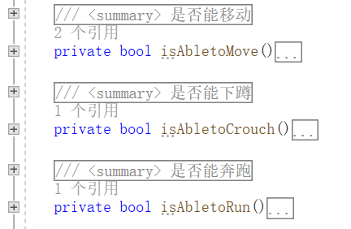

首先是移动方向计算 ，摄像机采用自实现的脚本完成一个带碰撞的第三人称相机，而相机方向更改人物移动主要是Yaw偏航角，也就是相机目前旋转的Y值。所以我们先获取输入，用反正切函数计算实际前进方向和当前角色前方朝向的夹角，然后加上相机的Y轴旋转值，他们都是往右为正，往左为负，这样就更正了移动方向。然后根据输入用插值方法设置当前的移动速度，根据目标方向旋转角色，调用Move方法移动角色。

然后是下蹲的实现，如果下蹲条件方法为真，那么就用bool值更换角色的下蹲状态，注意还要设定新的碰撞体高度和半径。翻滚采用Trigger完成，由于动画不具备Root Motion，所以这里的解决方法是采用Animation Curves为翻滚动画设置一个可获取的状态机参数作为翻滚时的移动速度，调用基类的移动接口完成翻滚的移动。

#### 敌人的移动

敌人的移动相对简单，由于不需要任何输入，所以采用基类方法就能完成，主要在AI的控制上，后面详细介绍AI的移动控制。

### 战斗系统框架

战斗体现为攻击，这种行为是玩家和敌人共有的，所以也需要抽取基类完成。基类需要实现的功能是攻击检测，玩家和敌人的攻击方式不同，需要通过继承实现。攻击检测方案为，在角色前方设置一个球形检测区域，如果攻击时敌人其中就判断为受到攻击了，此时根据碰撞信息调用敌人方法让敌人接受伤害，并使用资源类播放音效。

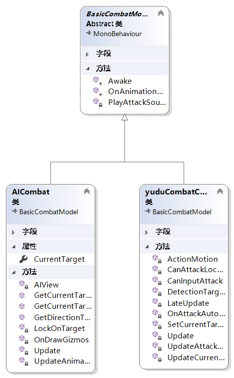

#### 玩家连招

玩家具有两种装备，Sword有四种攻击方式，Great Sword有三种攻击方式，招式之间可以相互衔接。连招使用Trigger触发，并且使用Reset Trigger取消重复触发，保证每个动画中攻击按键仅一次有效，防止多次误触。

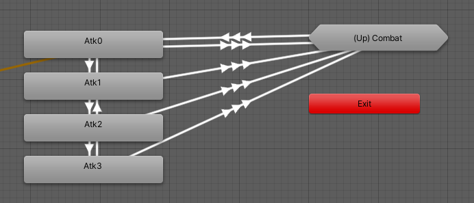

为保证输入有缓冲时间，让玩家能够在角色攻击动画没有播放到给定时间之前不能切换状态，攻击动画未完全结束之后按键随时切换状态，需要通过判断播放时间完成。那么ResetTrigger实际上有两个地方需要使用，一个是OnStateEnter中需要执行，保证触发器只会影响当前动画；另一个是判断能否更新攻击时，如果判断不能返回，那么一并要消除此时没有触发的触发器，否则即使返回了False，实际上状态机中的Trigger并不是False，因为状态机某种Bug，如果多次触发Trigger，那么OnStateEnter中的Reset似乎不会起效。

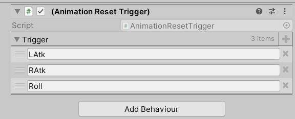

有时候重启能解决该问题，不过保险起见还是在返回False是重置Trigger。

#### 攻击矫正

另外为保证攻击手感，需要给角色的近距离攻击添加一个锁定目标，当角色靠近敌人攻击时需要让角色旋转朝向敌人，从而自动矫正攻击方向，否则玩家会经常因为攻击方向不正确而导致无效攻击。

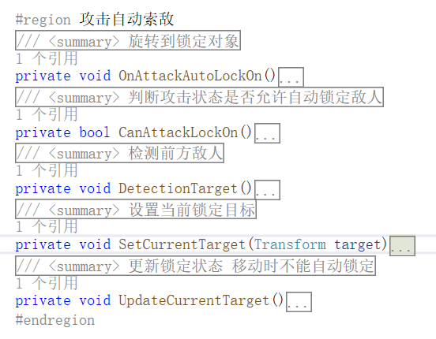

#### 攻击移动

攻击时角色的动画应该是有位移的，不过由于是Inplace动画，所以需要使用Animation Curves添加位移，调用移动基类方法完成攻击动画的移动。

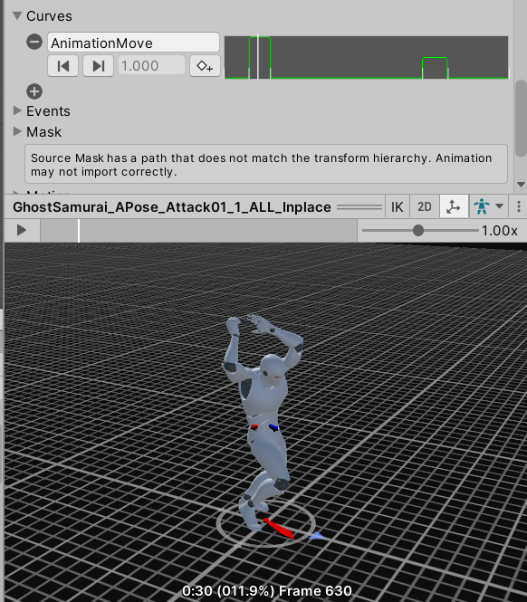

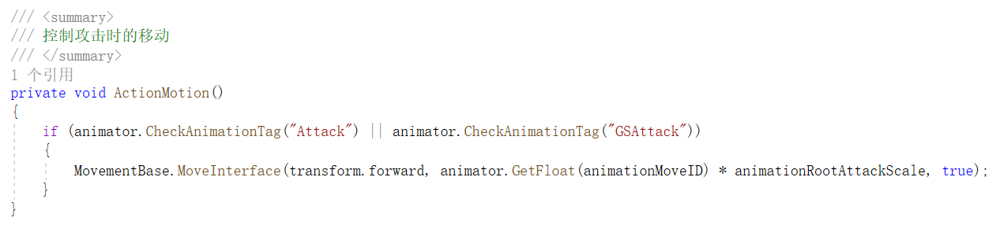

#### 武器切换

角色在打败敌人后能获得第二种武器，此时需要在两种武器之间进行切换。这里的解决方案是，将这些武器分别绑定在角色的手部骨骼和胸部骨骼后方，正常情况下如果装备Sword，那么启用手上的Sword，禁用背上的Sword；启用背上的Great Sword，禁用手上的Great Sword。装备Great Sword时同理。这里我选择用一个单独的装备类来管理角色的装备状态，他获取游戏对象的引用，然后分别在初始化、拾取大剑、切换武器时更改启用情况。

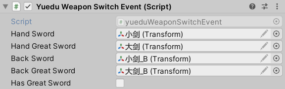

### 属性系统框架

角色拥有自己的属性，包括生命值，攻击力等信息，应该使用一个抽象类作为基类提供这些属性的更改方法，因此之前的接受伤害方法也会在这里实现。基类应该实现的主要功能是：

* 提供获取攻击力的外部方法，提供接受伤害的外部方法，这样可以通过动画事件的回调函数获取受击对象的属性系统类，该方法中还要设置当前的攻击者对象，调用接受伤害的外部方法获得攻击力，并实现受击伤害的结算。注意此时还要播放受击动画。
* 提供死亡事件方法，可重写，这样在子类中可以根据需要定制死亡事件，例如敌人死亡会掉落拉鲁，角色死亡会弹出结算UI；
* 提供必要组件的引用，尤其是UI管理器，UI管理器是UI系统的核心，后面会详细说明。

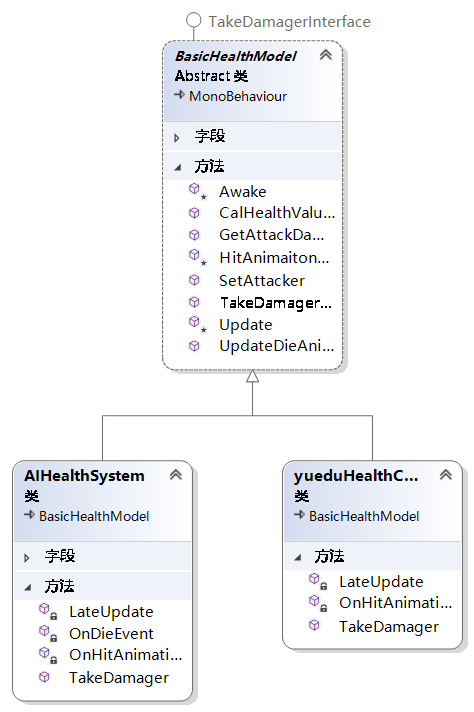

此外还有一些封装属性的其它小方法。下面我们需要给玩家和敌人分别继承来实现各自的属性系统，主要是重写死亡事件和伤害接受方法。此外为了优化战斗过程，还要添加一个受击旋转方法，让敌人和角色受击后旋转到面朝攻击者的方向，这样能让玩家方便调整角色姿态，因为攻击的同时无法移动。

### UI系统框架

所有需要使用的UI都通过Canvas下的UIManagement管理，该子对象用一个管理类获得所有UI的Panel的引用，除必要的内部方法外，提供封装好的外部方法来供所有其它类调用，也就是说所有会更改UI的对象动作都需要获得这个UIManagement的引用，这样就方便了UI的管理。我们接下来在之前的内容上进一步添加UI的功能。

#### 对话系统

根据剧情推进，角色和NPC的互动会发生变换，也就是需要对话框使用不同的角色头像，不同的文本内容，可以采用编写一个对话资源Scripts Objects来完成，资源用枚举类型根据具体任务分类存储文本配置，以及角色对话头像。具体的对话文本用txt存储，头像为Sprite类型，加载到SO上供对话系统读取。

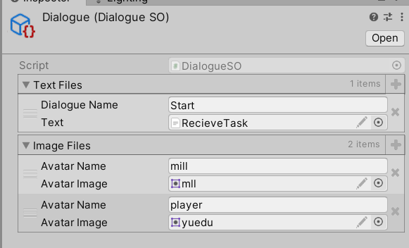

解析Text之后将文本按行存储在一个字符串List中，随按键触发更新到对话框的文本组件中，并根据文本中的标注选择获得对话头像。每个NPC的对话都使用该系统完成对话。

另外为了让字符能够逐个显示，采用协程的方式完成输出延迟，bool标识当前对话是否完成，只有完成对话才能进入下一个协程显示下一段对话的字符。

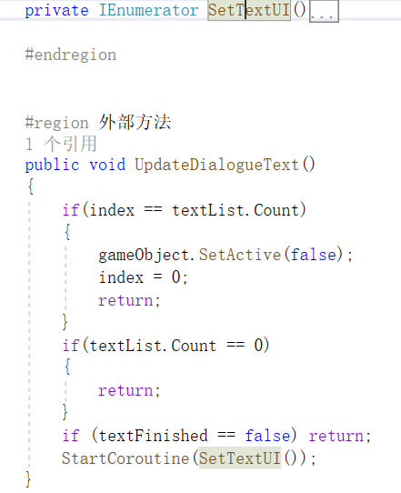

#### 背包系统

角色拾取装备或物品后后在背包中可以选择查看、更换武器，每个物品作为背包的Item资产，该资产也是Scripts Objects，包含物品对应的图片和描述文本，目前数据持久化同样使用SO完成，因此还包括物品的数量，在编辑器中此方法是可行的。

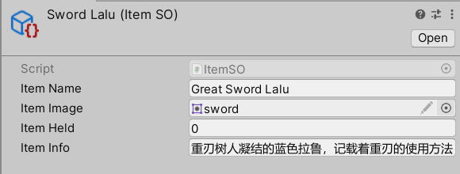

此外，还需要为背包设计一个SO存储所有的Item：

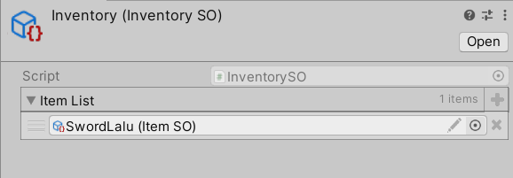

此时UI可以通过读取Inventory中Item的信息更新背包的内容。不过要注意，使用Scripts Objects进行数据持久化的方法只能在编辑器中作为功能测试使用，更普遍的做法是使用Json或者Database存储物品的ID和信息。

### 任务系统框架

RPG游戏中任务也是很重要的一部分，之前的对话系统也算任务系统的一个子系统，只不过为了规范把它单独作为一个系统提供一些外部方法供任务系统调用。任务目前仅有主线任务，因此主任务id只有一个，它标识了任务的总体；子id是任务的细节，例如角色执行一个动作，因此当前任务的子id就是三个，接取任务，击败敌人，完成任务。

任务配置采用Excel转Json完成，我们首先配置该主线任务的配置表如下：

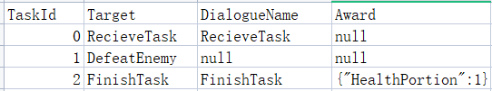

## 美术风格

使用卡通渲染风格，管线为Universial RP，其中场景使用资产自带的Shader，人物使用UnityURPToonLitShaderExample的开源Shader。

## 音效设计

包括背景音乐，武器挥动音效，受击音效。使用Scripts Objects创建音效分类清单管理音效Clip，背景音乐默认播放不做管理，音效清单有Sword，Great Sword，Hit三种类型的音效。

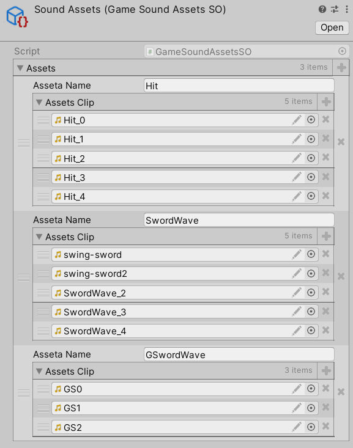

音效清单获取音效后，初始化方法中用字典存储文件和对应音效名方便查找，给出GetClip方法根据类型随机返回该类别中的某个音效。

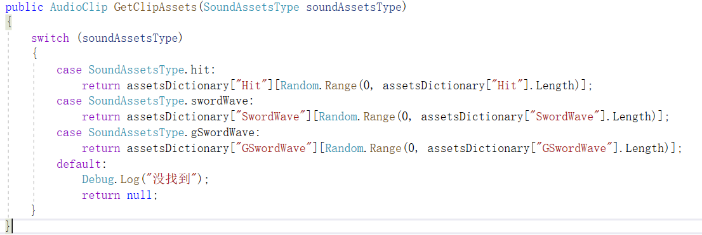

使用GameAssets类继承实现单例，Awake调用初始化处理文件字典索引，并给出PlaySoundEffect方法设置AudioSource的Clip并播放该Clip。

