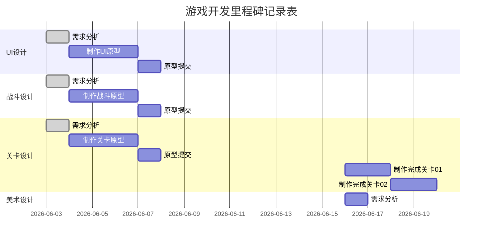

# 项目计划

## 基本信息

- 项目名称：待定
- 项目开始日期：6.3
- 项目结束日期：待定
- 团队组长：
- 团队成员：

## 项目目标

- 总体目标：课程游戏设计，这是一个3D即时战斗的RPG游戏。

## 项目里程碑

某个系统、模块制作完成后，及时在下面里程碑表格中对应的section进行修改。


## 内容和工作分配

### 策划+美术内容：

* 文案策划：世界观、剧情，如过场动画等设计；
* 系统策划：玩法逻辑设计和系统框架设计；
* 战斗：战斗流程、连招、敌人；
* 关卡策划：副本、地形、场景
* 交互/音频/美术表现：UI，音效，配乐，角色动画，渲染表现；


### 程序内容：

* (3)GamePlay：玩法、各游戏对象、动画、摄像机、角色控制器、AI；
* (1)UI+音效：界面设计，交互，音效系统；
* (1)TA：纹理、光照、材质、后处理、物理模拟、特效；


### 具体分工

(照下面这样填写详细设计时想做的任务，现在做原型部分主要是系统，战斗，关卡，还有少量文案，美术先放一放)

|  成员  |    策划职责    | 描述                                                         |  程序职责   | 描述                                                         |
| :----: | :------------: | :----------------------------------------------------------- | :---------: | :----------------------------------------------------------- |
|        |                |                                                              |             |                                                              |
| 高梓钦 | 战斗/系统/美术 | 设计角色的战斗流程，设计游戏流程和游戏系统框架，制定美术表现要求 | GamePlay/TA | 制作角色控制器，包括非战斗的移动和战斗中的移动，连招系统的动画状态机；根据游戏流程搭建游戏框架；根据美术要求调整模型材质、shader表现 |
|        |                |                                                              |             |                                                              |
|        |                |                                                              |             |                                                              |
|        |                |                                                              |             |                                                              |

## 开发环境

* Unity 2020.3.45(及以前版本，后面的版本可能有问题) 3D URP

* 版本控制Git，[仓库地址](https://github.com/ANKIIMA/GameDesign-ARPG)。

## 其它说明

## 开发注意

* 修改时记得拉分支，尽量做完一个完整的模块如一个场景或一个敌人的控制，之后再合并到Main，否则可以先保留在自己的分支。
* 使用预制件进行开发，在游戏对象中选择预制件的override模式。
* 注意Tags和脚本中的命名规范。
* 原型建议直接脚本开发，比Games Creator清晰，如果有小问题可以后面改，做一个大概即可。

### 素材网站

有其它推荐可以放在这里。

#### 动画

* https://www.mixamo.com/#/单纯的动画网站Mixamo，能找到多数的一般动作；
* https://assetstore.unity.com/资产商店，每周开发者能嫖一个付费资产；

#### 音效/配乐

* https://www.aigei.com/上面音效配乐为主，也有一些特效UI等素材；

#### 模型

* https://www.aplaybox.com/模之屋的模型以二次元为主，但是使用需要用Blender的cats插件将pmx转成fbx，具体看这篇[博客](https://ankiima.github.io/2023/04/20/unity8/#more)；
* https://gamedev3d.com/forum-92-1.html游研堂除了模型还有动作，不过感觉比较少，而且好像多数要付费；

# 设计文档

原型阶段可以简略写，之后进一步补充，尽量多用游戏举例子说明这里设计什么。

## 游戏基本信息(文案写)

- 游戏名称：待定
- 游戏类型：ARPG/JRPG
- 游戏世界观/剧情：

## UI设计

参见UI设计文档，内容可以参考如下。写完后可以复制md过来。

```
开始画面

* 标题 / 开始界面的图像LOGO，相关的动画效果和图片。
*  列出玩家可用的选项：新游戏、读档、游戏设置、退出游戏、画廊等等。
*  存档 / 读档文件：描述怎样保存和读取游戏进度，以及存档文件的显示形式：截图+时间+进度、命名方式。
*  玩家选项 / 游戏设置：视频（video）、音频（audio）、控制（control）等。

- - ² 视频：分辨率、亮度、对比度、字幕等，即所有视觉上的设置。
  - ² 音频：音乐、音效的音量等，即各种听觉上的设置。
  - ² 控制：玩家的输入控制、按键绑定、输入设备的切换等。

加载画面

更换场景，或者进入游戏时播放的游戏画面。

HUD系统

在屏幕上描述或图示化信息给玩家看的。例如生命值/状态、能量/燃料、钱、计时器、小地图、仪表盘、生命数/续命数、目标，“捕食者视角”、子弹时间等特殊视角。

暂停UI

暂停游戏后提供一系列选项，如打开地图，背包等。

背包

-  列举所有工具或者能放进背包的物品
-  玩家会用到的东西 以及 用法
-  描述或者用插图说明背包界面
-  玩家怎么拿到物品

地图

显示当前角色位置，地形，任务指引等信息。

游戏流程

用图表描述上面各种UI的衔接，展示从“标题/开始界面”（或者开场动画之类的）到“游戏结束”，各个界面（场景、进程、关卡）之间如何串联起来的。
```

## 战斗设计

参见战斗设计的文档，描述或用图示说明战斗中所有的行动和反应，包括：连击、不同武器类型（通用的和特定分类的）、武器科技树、攻击范围、如何装备、如何重新装填、如何更换武器、锁定和瞄准系统。要描述达成机制以后会有什么表现，不论是音效还是视觉上。

多看游戏战斗拆解，要精确到数值上，写完后可以复制md过来。可以参考以下内容：

```
### 生命值系统

描述HUD中如何显示出最新的生命值；什么情况下玩家掉血和补血；玩家如何得知生命偏低的情况。精确到参数。

-  非常状态 —— 描述全部的玩家可能会进入的非常状态（眩晕、中毒、变成婴儿等），以及这些状态对操作的影响。
-  命数（如果有的话） —— 说明怎么获得或失去命数，以及命数用完的结果。
-  死亡（如果有的话） —— 描述死亡时会发生什么情况。列举出需要特殊动画的情况（开火、溺水等）。游戏结束时会怎样？游戏结束的画面是怎么样？死亡会有惩罚吗？
-  检查点系统 —— 描述游戏里的检查点系统。自动保存系统是如何工作的。

### 战斗得分

给各种动作赋予分数值，然后解释一下当玩家达到了要求会发生什么，在游戏里玩家如何获取额外奖励（比如连招或者连击），例如破晓传说中玩家连击达到一定条件进入狂热，或者能配合队友进行特殊攻击。要描述达成机制以后会有什么表现，不论是音效还是视觉上。精准到动作和参数。

### 战斗机制

描述角色如何进行战斗，战斗的核心机制是什么，例如只狼的架势，原神的元素反应，破晓传说的技能点，永劫无间的僵直连招。精准到动作和参数。

### 敌人和弱点

设计不同敌人，围绕战斗机制设计它们的特性，体现游戏的策略性，例如如何应对快速移动的敌人和难以破防的敌人。要描述达成机制以后会有什么表现，不论是音效还是视觉上。同样精准到参数，例如敌人的韧性之类的。

### 可使用的道具

添加到道具设计的清单中，说明道具用途和获得方式。精准到参数和动作。

### 资源管理

达成上述条件之后，注重打击感和画面，在上面设计同时最好用表格管理镜头，音效，画面的处理，精准到用什么参数什么设置。
```

## 关卡设计

参见关卡设计的文档，描述各个关卡内容和它们之间的关系，放置敌人和NPC。写完后可以复制md过来。可参考下面的内容：

```
### 关卡清单

- 列举世界纵览中提到的每个关卡，包括：名字、简述、主要玩点、敌人以及能在关卡中发现的物品等等。
-  如果关卡和剧情有什么关联，记得加以描述。
-  包括一张清单，内容涵盖一种的时间设定、颜色指南以及音乐需求。

### 通用敌人规则

-  列举不同类型的行为（巡逻的、飞行的等）以及AI具有哪些行为。
-  描述敌人出生以及被击败的参数。
-  列出奖励规则。

### 特定关卡的特殊敌人

-  提供敌人的一张图片和一段描述，以及它会在游戏中出现的地方。
-  列出所有行动和攻击模式，以及玩家战胜敌人的方法。
-  描述不同敌人的各种混合攻击或者遭遇战。
-  描述敌人被击败时会发生什么，以及玩家能够因此得到什么奖励。

### Boss

-  为每个boss以及他们所在的环境提供图片和描述
-  解释玩家怎样触发战斗，以及打起来是什么感觉。
-  列举所有行动、攻击模式以及玩家战胜敌人的方法。
-  描述Boss被打败时会发生什么，以及玩家能够因此获得什么。

### NPC

-  列举游戏中的全部角色。
-  提供描述、图片以及出现的时间地点。
-  列出他们在游戏整体框架下的功能。
-  列出和它们相关联的奖励或物品。

### 可使用的道具

上面的设计中如果有新道具，添加到道具设计的清单中，说明道具用途和获得方式。
```

## 系统设计

描述游戏的基本框架，围绕游戏拆解的闭环任务，资源-成长-校验，进行设计，也可根据3h理论展开，说明游戏如何循环，每个部分的内容是什么，游戏目标是什么。写完后可以复制md过来。

## 美术风格

暂缓

- 描述游戏的美术风格。
- 包括人物造型、场景布置、特效设计等内容。

## 音效设计

暂缓

- 描述游戏的音效设计。
- 包括游戏音乐、音效等方面的内容。

# 资源清单和目录

说明项目文件结构，主要是资产的位置，后续版本管理中只对项目设置和脚本、shader进行同步，所以不会上传资产，后续资产可能通过群文件分享。更改结构记得在这里修改项目结构说明。

```
├─Animations		存放动画资源
├─Audios			存放音频资源
├─Models		   	存放模型的FBX和材质，配套纹理，材质和纹理分别使用一个和FBX同级的文件夹。
├─Others			存放Input System的配置文件，对话文本等内容。
├─Prefabs			存放预制件
├─Shaders			存放着色器
├─Scenes			存放场景
├─Scripts			存放脚本文件
└─Sprites			存放图片资源，注意这里不存放模型的纹理，模型配套的纹理和模型放在一起。这里主要是UI和地编使用。
```

