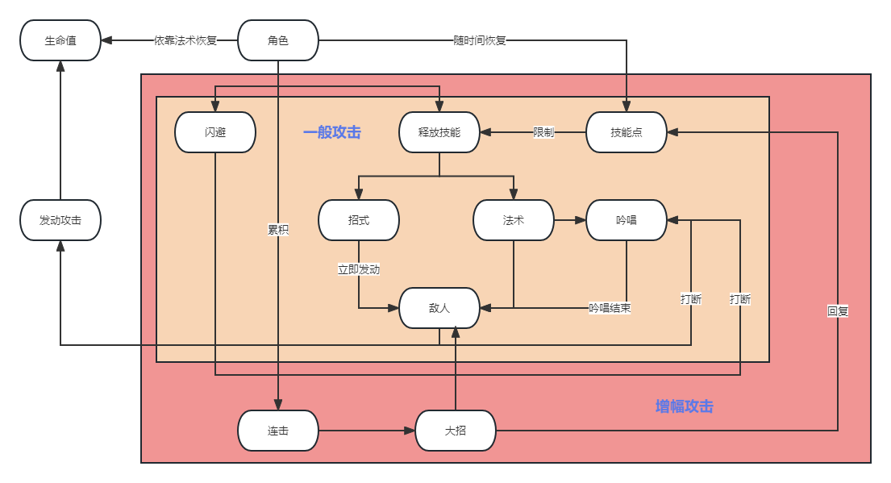

# 战斗设计文档

## 原型阶段

### 战斗机制

描述角色如何进行战斗，战斗的核心机制是什么，例如只狼的架势，原神的元素反应，破晓传说的技能点，永劫无间的僵直连招。精准到动作和参数。

### 概述

战斗中玩家的行为可以用下图概括：

#### 攻击方式

攻击分为增幅攻击和一般攻击。

一般攻击根据场上角色有不同的攻击方式，目前指定战士和法师两种，攻击方式也分为两种，招式和法术，这两种攻击方式战士和法师都可以使用，但是战士的招式攻击占比大，法师的法术攻击占比大。角色使用这两种攻击时需要消耗技能点，根据技能点花费的多少，技能具有不同的伤害幅度，而且招式可以立即发动，而多数法术则需要吟唱，被打断则法术释放失败。敌人的攻击和角色主动闪避都会打断法术的吟唱。

增幅攻击是当角色的连击数累计到一定数值以后，角色此时可以释放特殊的攻击。

#### 数值系统

游戏中战斗的数值方面分为生命值，攻击力，防御力，还有技能点，连击数5种数值，其中除技能点和连击数是角色特有外，前四种属性敌人和角色是共有的。

* 生命值是一个单位在战斗中存活的依据，减小到0后单位死亡；
* 攻击力是单位攻击后造成伤害的依据；
* 防御力能使单位对受到的伤害进行衰减；
* 技能点限制技能释放；
* 连击数随攻击命中累计；

实际伤害=max(0,攻击力*技能倍率/(防御力/攻击力))

